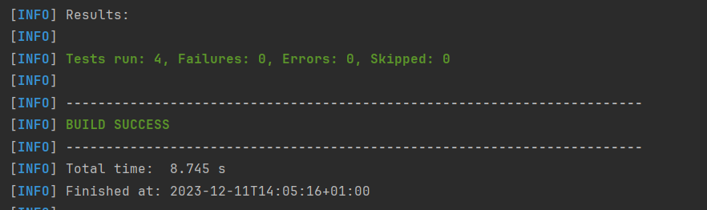

= R5.A.08 -- Dépôt pour les TPs
:icons: font
:MoSCoW: https://fr.wikipedia.org/wiki/M%C3%A9thode_MoSCoW[MoSCoW]

Ce dépôt concerne les rendus de mailto:A_changer@etu.univ-tlse2.fr[Jonh Doe].

== TP1

.Exemple de code
[source,java]
---
Feature: is_it_friday_yet

  Scenario Outline: is It Friday ?
    Given today is "<day>"
    When I ask whether it's Friday yet
    Then  I should be told "<answer>"

    Examples:
      | day            | answer |
      | Friday         | TGIF   |
      | Sunday         | Nope   |
      | anything else! | Nope   |

---

.Résultat 

== TP2

[source,java]

package dojo;
import java.util.ArrayList;
import java.util.List;
public class Order {
    String owner;
    List<String> cocktailsOrdered = new ArrayList<>();
    String target;
    public void declareOwner(String owner) {
        this.owner = owner;
    }
    public void declareTarget(String target) {
        this.target = target;
    }
    public List<String> getCocktails() {
        return cocktailsOrdered;
    }
}

.Résultat 

== TP3

Voici mon feature : 
[source,gherkin]

Feature: Where are my keys?
  I lost my keys and i want to find them
  Scenario: I want to find my keys
    Given I look for my keys and i can't find my keys
    When i look everywhere in my apartment in found them in my pocket
    Then I have 

Voici mes steps : 

[source,java]

Apartment apart;
    @Given("I look for my keys and i can't find my keys")
    public void i_look_for_my_keys_and_i_can_t_find_my_keys() {
        // Write code here that turns the phrase above into concrete actions
        apart = new Apartment();
        apart.hasKeys = false;
    }
    @When("i look everywhere in my apartment in found them in my pocket")
    public void i_look_everywhere_in_my_apartment_in_found_them_in_my_pocket() {
        // Write code here that turns the phrase above into concrete actions
        apart.lookForKey("Pocket");
    }
    @Then("I have my keys and i can leave")
    public void i_have_my_keys_and_i_can_leave() {
        // Write code here that turns the phrase above into concrete actions
        assertEquals(apart.hasKeys, true);
        apart.leave();
    }

Et voici ma classe Apartment : 

[source,java]

public class Apartment {
    String keysLocation;
    Boolean hasKeys;
    Boolean closeDoor;
    public void lookForKey(String location) {
        this.keysLocation = location;
        this.hasKeys = true;
    }
    public void leave() {
        this.closeDoor = true;
    }
}

.Résultat 

